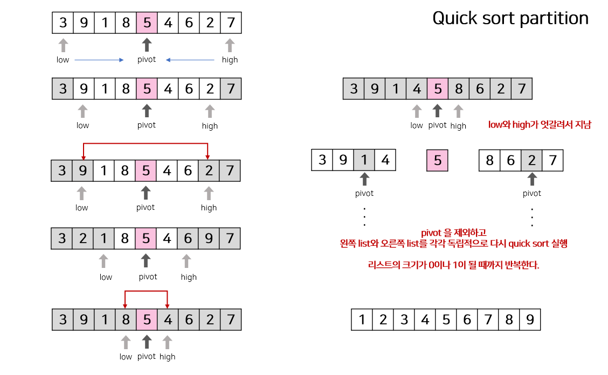

# Quick Sort (퀵 정렬)
_‘찰스 앤터니 리처드 호어(Charles Antony Richard Hoare)’_  

### ✔ 요약
> 정렬되지 않은 리스트를 pivot을 기준으로 하나의 원소만 포함할 때까지 부분리스트로 분할한 후,  
> 부분리스트를 병합하여 최종적으로 정렬된 리스트를 만든다.

<br/>
<br/>

* `불안정 정렬`
> **불안정 정렬**  
> 중복된 값이 입력 순서와 동일하지 않게 정렬.   
> 대표적으로 `퀵정렬(quick sort)`, `선택정렬(selection sort)` 등이 있다.  
> _안정 정렬은 중복된 값을 입력 순서와 동일하게 정렬. (정렬하기 전/후 순서가 유지된다.) 대표적으로 `삽입정렬(insertion sort)`, `합병정렬(merge sort)`, `버블정렬(bubble sort)`_

* `비교정렬`
> 다른 원소와의 비교만으로 정렬을 수행하는 비교 정렬

* `분할 정복 알고리즘(divide and conquer)`
> **divide and conquer**  
> 문제를 작게 분리하고 해결한 다음 결과를 모아 원래 문제 해결하는 전략으로 대개 순환 호출을 이용하여 구현한다.


<br/>


* n개의 데이터를 정렬할 때 __최악의 경우에는 O(n^2)__ 번의 비교를 수행하고, __평균적으로 O(n log n)__ 번의 비교를 수행
* 리스트에서 하나의 원소를 고르고 해당 원소를 `피벗(pivot)`이라고 칭한다.
  * 피벗 선택: 첫 번째, 중간, 마지막, 랜덤 (선택 방식에 따라 속도가 달라져 중요하다.)
  * __피벗이 최소나 최대값일 경우 파티션이 나누어지지 않아 O(n^2)에 대한 시간복잡도를 가진다.__
    * 피벗을 선택할 때 **중간 요소로 선택**하면 해결이 가능하다.
* 피벗을 기준으로 리스트를 둘로 나눈다.  
* 분할된 두 개의 작은 리스트에 대해 재귀(Recursion)적으로 리스트의 크기가 0이나 1이 될 때까지 이 과정을 반복한다.

### Quick Sort 단점
1. 피벗 값이 최소나 최대값으로 지정되어 파티션이 나누어지지 않았을 때 O(n^2)에 대한 시간복잡도  
   ex) 이미 정렬된 리스트  
   👉 크기순으로 중간 값을 피벗으로 선택한다.
### Quick Sort 장점
1. 빠른 속도 - 다른 O(nlogn) 시간복잡도를 가진 소트들보다 빠르다고 알려져있다.
   * 먼거리 교환 처리 + 캐시 효율 (한 번 선택된 기준은 제외시킴)
2. 추가 메모리 공간을 필요로 하지 않는다. 
   * O(log n)만큼의 메모리를 필요로 한다.

<br/>





``` java
private void solve() {
    int[] array = { 80, 70, 60, 50, 40, 30, 20 };
    quicksort(array, 0, array.length - 1);
}

public static void quicksort(int[] array, int left, int right) {
    // left >= right인 경우 
    // -> 정렬할 범위가 2개 이상의 데이터인 경우
    // (리스트의 크기가 0이나 1인 경우)
    if (left >= right) {
        return;
    }
 
    // 피벗을 기준으로 리스트를 비균등 분할 - 분할(Divide)
    int pi = partition(array, left, right);
 
    // 정복(Conquer)
    // 교환된 피벗(pi) 기준으로 왼쪽엔 피벗보다 작은 값, 오른쪽엔 큰 값들만 존재한다.
    quicksort(array, left, pi - 1); // pivot 기준 pivot보다 작은 list
    quicksort(array, pi + 1, right); // pivot 보다 큰 list
}

public static int partition(int[] array, int left, int right) {
    int mid = (left + right) / 2; // 중간 요소를 pivot으로 선택 -> 생략시 최악의 경우 발생 가능성 있음
    swap(array, left, mid);
 
    // 피벗 선택
    int pivot = array[left];
    int i = left, j = right;
 
    while (i < j) {
        // 오른쪽(j)에서 왼쪽으로 가면서 pivot보다 작은 수를 찾는다.
        // array[j]가 pivot보다 크면 계속 j를 감소
        while (pivot < array[j]) {
            j--;
        }
        // 왼쪽(i)에서 오른쪽으로 가면서 pivot보다 큰 수를 찾는다.
        // array[i]가 pivot보다 작으면 계속 i를 증가
        while (i < j && pivot >= array[i]) {
            i++;
        }
        // array[i]와 array[i] 교환
        swap(array, i, j);
    }
    // i와 j가 교차했으면 반복문을 나와 array[left]와 array[i]를 교환
    array[left] = array[i];
    array[i] = pivot;
    // 피벗 위치 반환
    return i;
}
 
public static void swap(int[] array, int a, int b) {
    int temp = array[b];
    array[b] = array[a];
    array[a] = temp;
}

```


### Quick sort와의 차이점
|Merge Sort|Quick Sort|
|---|---|
|영역을 쪼갤 수 있는 만큼 쪼갠 후 합병하며 정렬한다.|pivot을 통해 우선 정렬한 후, 영역을 쪼갠다.|
|순차접근|임의접근|  

👉 LinkedList 정렬시, Quick Sort보다는 Merge Sort가 더 좋다.  


[참고](https://gmlwjd9405.github.io/2018/05/10/algorithm-quick-sort.html)  
[코드 참고](https://github.com/gyoogle/tech-interview-for-developer/blob/master/Algorithm/QuickSort.md)  
