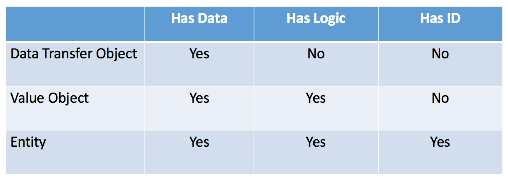

# DTO & VO

Created: September 26, 2021 3:38 PM
Last Edited Time: January 21, 2022 9:52 AM

## Data Transfer Object

DTO는 본래 프로세스간 Remote 함수 호출의 비용을 줄이기 위해 만들어진 기법이다. 

출처 : P of EAA : Data Transfer Object

위 이미지를 살펴보면 앨범은 제목을 갖고, 아티스트와 연관이 있다. 원격 함수 호출 방식으로 간다면 앨범의 제목을 요청하고, 아티스트의 이름을 각각 요청을 해야한다. 하지만 DTO를 이용해 두 정보를 한번에 전송하면 호출 비용이 1회로 줄일 수 있는 장점이 있다.

많은 사람들이 Sun 커뮤니티의 **Value Ojbect**와 같다고 말하지만 다르다. 무엇이 다른지 아래에서 살펴보자.

## Value Object

Value Object는 Immuatble Object (불변 객체)다. 객체 내 모든 필드들을 final로 선언을 해 생성할 때만 초기화 가능하게해, 추가적인 값 변동 없이 값 그자체로 사용하는 객체들을 말한다.

VO를 사용했을 때 얻는 이점은 아래와 같다.

1. VO객체를 합쳐서 계산적인 이점을 얻을 수 있다.
2. 엔티티가 논리적인 복잡성에서 벗어날 수 있다.
3. 올바르게 사용만 한다면 테스트 가능성 및 **동시성 문제를 해결**할 수 있다.

## DTO & VO

참고한 사이트에서는 DTO와 VO를 동일하게 보는 개발자가 많음을 지적하였다. 겉 보기에는 비슷해 보이지만 큰 차이점을 가지고 있기 때문이다. 

첫번째로 VO는 Immutable한 객체이다. 이는 동시성 문제를 해결하는 중요한 포인트가 된다. 
두번째로 DTO와 달리 VO는 로직을 포함할 수 있다. DTO는 단순히 정보를 전달하기만 하는 객체이기 때문에 추가적인 로직함수를 포함할 수 없다.

**DTO는 값을 전달하기 위한 Wrapper**라고 생각하는 것이 편하다.

### 참고

[https://martinfowler.com/eaaCatalog/dataTransferObject.html](https://martinfowler.com/eaaCatalog/dataTransferObject.html)

[https://martinfowler.com/bliki/ValueObject.html](https://martinfowler.com/bliki/ValueObject.html)

[https://multifrontgarden.tistory.com/182](https://multifrontgarden.tistory.com/182)

[https://dzone.com/articles/ddd-part-ii-ddd-building-blocks](https://dzone.com/articles/ddd-part-ii-ddd-building-blocks)