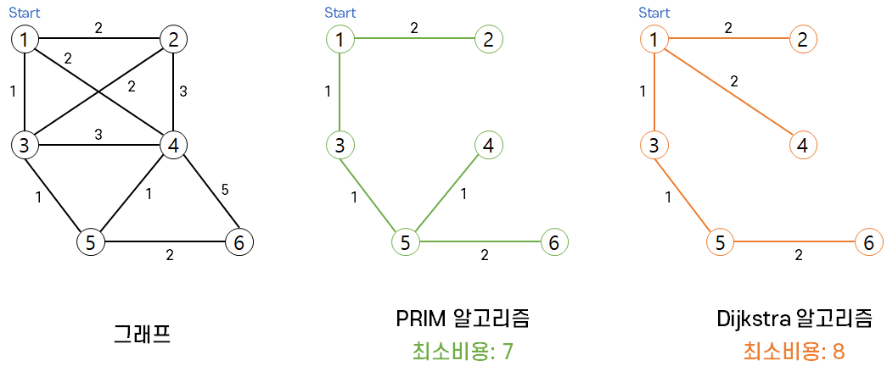

# 다익스트라(Dijkstra) 알고리즘

## 요약

>다익스트라 알고리즘이란 하나의 정점에서 그래프 상에 존재하는 다른 모든 정점, 즉 **두 정점 사이의 최단거리**를 구하는 알고리즘이다.

## 정의

- 다이나믹 프로그래밍을 활용한 대표적인 **최단 경로(Shortest Path) 탐색 알고리즘**
  - 최단 경로란 **간선의 가중치가 있는 그래프**에서 두 정점 사이의 경로들 중에 **간선의 가중치 합이 최소**인 경로
  
- 하나의 정점에서 **다른 모든 정점으로 가는 최단 경로**를 구하는 알고리즘
  - 즉, **두 정점 사이의 최단거리를 구하는 알고리즘**
  
- 음의 가중치를 허용하지 않는다. (오로지 **양의 가중치**)

- 현실 세계에 사용하기 매우 적합한 알고리즘 중 하나<br/>
  ex) 인공위성 GPS 소프트웨어

- **그리디 기법을 사용**한 알고리즘으로 **<u>MST의 프림 알고리즘과 유사</u>**하다.

- 의사코드1(인접행렬 ver)

  ```
  s: 시작 정점, A: 인접 행렬, D: 시작정점에서의 거리
  V: 정점 집합, U: 선택된 정점 집합
  
  Dijkstra(s, A, D)
  	U = {s};
      FOR 모든 정점 v
  		D[v] = A[s][v]
  	WHILE U != V
  		D[w]가 최소인 정점 w ∈ V-U를 선택
  		U = U ∪ {w}
  		FOR w에 인접한 모든 미방문 정점 v
  			D[v] = min(D[v], D[w] + A[w][v])
  ```

  - while문은 n-1번 반복. **O(N)**
  - D[w]가 최소인 정점을 찾아야하니 **O(N)** 반복
  - 따라서 **인접행렬로 구현**하면 **시간 복잡도**는 **O(N²)**

- 의사코드2(우선순위 큐 ver)

  ```
  Q: 우선순위 큐
  
  d[s] = 0
  for each v ∈ V - {s}
  	do d[v] ← ∞
  S ← ∅
  Q ← V
  while Q != ∅
  	do u ← EXTRACT-MIN(Q)
  		S ← S ∪ {u}
  		for each vertex v ∈ Adj[i]
  			do if d[v] > d[u] + w[u, v]
  				then d[v] ← d[u] + w[u, v]
  ```

  - 그래프 모든 간선은 최대 한 번씩 검사한다. **O(E)**

  - 우선순위 큐에 [거리, 정점] 정보를 넣고 빼는 과정

    최악의 경우 모든 간선을 검사할 때 마다 거리 값 리스트가 갱신되고, 우선순위 큐에 정보가 저장되는 경우이다. <br/>E개의 간선을 검사할 때 마다 우선순위 큐를 유지해야 하므로 **O(ElogE)**

  - 따라서 **우선순위 큐로 구현**하면 총 **시간 복잡도**는 O(E) + O(ElogE) = **O(ElogE)**

## 프림과 다익스트라 차이



- **프림은 다익스트라와 달리 두 노드 사이가 최단거리가 아닐 수도 있다.**
- 프림이 다익스트라를, 다익스트라가 프림을 보장해주지 않는다.

| 프림 알고리즘                                          | 다익스트라 알고리즘                                    |
| ------------------------------------------------------ | ------------------------------------------------------ |
| 최소 신장 트리                                         | 최단경로 알고리즘                                      |
| 전체 그래프 관점에서의 모든 정점들을 최소비용으로 연결 | 정점 간의 최단 거리 연결                               |
| 정점 간의 최소 비용을 보장X                            | 정점 간 최소 비용을 보장                               |
| 무향그래프에서만 사용                                  | 무향,유향 그래프에서 모두 사용(단, 양의 가중치인 경우) |

