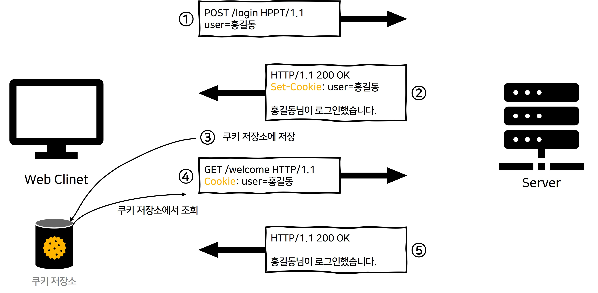
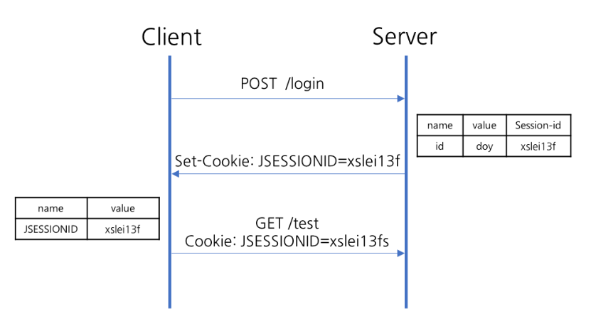

# 쿠키와 세션의 차이
## 요약
> **쿠키**
> - 클라이언트의 로컬에 저장되는 키와 값의 작은 데이터
> - 텍스트 형식으로 저장된다. 
> - 브라우저 종료시에도 로컬에 남아있을 수 있으며 보안에 민감한 데이터는 저장하면 안된다.
>
> **세션**
> - 일정시간동안 같은 브라우저로 들어오는 일련의 요구사항을 하나의 상태로 보고 그 상태를 유지하는 기능
> - 서버에 Object 형식으로 저장된다. 
> - 브라우저 종료 시 무조건 삭제되며 쿠키보다 보안이 좋다.

## 왜 쿠키와 세션을 사용할까?
HTTP 프로토콜은 `Stateless, Connectionless`한 특징을 가지기 때문에 **데이터 유지가 안돼서 서버는 클라이언트가 누구인지 매번 확인**해야한다. 

따라서, 상태 유지(Stateful) 경우를 대처하기 위해서 쿠키와 세션을 사용한다.

- **Stateless 프로토콜**
   - 클라이언트의 상태 정보를 가지지 않는 서버 처리 방식
   - 클라이언트와 첫번째 통신에서 데이터를 주고 받았다 해도, 두번째 통신에서 이전 데이터를 유지하지 않는다.

- **Connectionless 프로토콜**
   - 클라이언트가 서버에 요청(Request)을 했을 때,그 요청에 맞는 응답(Response)을 보낸 후 연결을 끊는 처리방식
   - HTTP 1.1 버전에서 연결을 유지하고, 재활용 하는 기능이 Default 로 추가되었다. (keep-alive 값으로 변경 가능)
   
## 쿠키(Cookie)
### 쿠키란?
- 웹 서버가 브라우저에게 지시하여 **클라이언트의 로컬 컴퓨터**에 파일 또는 메모리에 저장하는 **작은 데이터 txt 파일**
- 파일에 담긴 정보는 인터넷 사용자가 같은 웹사이트를 방문할 때마다 읽히고 수시로 새로운 정보로 바뀔 수 있다.
- 사용자 인증이 유효한 시간을 명시할 수 있으며, 유효 시간이 정해지면 브라우저가 종료되어도 인증이 유지된다. (Permanent 쿠키)
- 최대 파일 크기는 4KB, 로컬에 최대 300개 저장 가능, 하나의 도메인 당 20개의 값만 가질 수 있음
- **보안에 민감한 데이터는 저장하면 안됨** (주민번호, 신용카드 번호 등)
- 쿠키에 대한 정보를 매 헤더에 추가하여 보내기 때문에 **상당한 트래픽을 발생**시킴
- HTTP cookie, web cookie, internet cookie 라고도 부른다.

### 쿠키의 구성 요소
|  요소           | 정의 |
|-----------------|------|
|이름(Name)       |각각의 쿠키를 구별하는데 사용되는 이름|
|값(Value)        |쿠키에 저장된 값|
|유효시간(Expires)|쿠키의 유지시간  `Expires=Wed, 21 Oct 2015 07:28:00 GMT;`|
|도메인(Domain)   | 쿠키를 전송할 도메인|
|경로(Path)       | 쿠키를 전송할 요청 경로|

### 쿠키 동작 방식
1. 클라이언트가 HTTP 요청을 함
2. 서버는 응답과 함께 `Set-Cookie` 헤더를 전송
3. 웹 브라우저 내부에 있는 **쿠키 저장소**에 저장됨. 
    유효시간이 명시되어 있다면 브라우저가 종료되어도 보관하고 있음
4. 같은 서버로 요청 할 경우, 쿠키는 `HTTP 헤더`안에 **포함**되어 보내짐.
5. 서버에서 쿠키를 읽어 이전 상태 정보를 변경 할 필요가 있을 때 쿠키를 업데이트 하여 변경된 쿠키를 `HTTP 헤더`에 포함시켜 응답

### 사용 예시
- 쇼핑몰 장바구니
- 방문 사이트 로그인 시, "아이디와 비밀번호를 저장하시겠습니까? (세션 관리)
- 광고 정보 트래킹 (사용자 행동을 기록하고 분석하기 위해)

## 세션(Session)
### 세션이란?
- 웹 사이트의 여러 페이지에 걸쳐 사용될 수 있도록 사용자 정보를 저장하는 방법을 의미
- 클라이언트를 구별하기 위해 `HTTP Session ID` 부여
- **데이터**는 서비스가 돌아가는 **서버DB에 저장**하고, **세션의 키값** (`HTTP Session ID`)만 클라이언트의 **쿠키**형태로 **메모리에 저장**
- 메모리에 저장하기 때문에 브라우저가 종료되면 사라지게 된다.
- 물론 접속 시간에 제한을 두어 일정 시간 응답이 없다면 정보가 유지되지 않게 설정이 가능
- 보안에 취약한 **쿠키를 보완**해주는 역할 (사용자 정보를 서버에 두기 때문)
- 그러나, 동접자 수가 많은 웹 사이트인 경우 **서버 메모리를 많이 차지**하게 되므로 **성능 저하의 요인**이 된다.
   - 이러한 이유로 쿠키가 유리한 경우는 쿠키를 사용한다.

### 세션 동작 방식
1. 클라이언트가 서버에 접속 시 `Session ID` 발급 받음
2. 클라이언트는  `Session ID`에 대해 쿠키를 사용해서 저장하고 가지고 있음
3. 클라리언트는 서버에 요청할 때, 이 쿠키의 `Session ID`를 같이 서버에 전달해서 요청
4. 서버는 `Session ID`를 전달 받아서 별다른 작업없이 `Session ID`로 세션에 있는 클라언트 정보를 가져와서 사용
5. 클라이언트 정보를 가지고 서버 요청을 처리하여 클라이언트에게 응답

### 사용 예시
- 로그인 같이 보안상 중요한 작업을 수행할 때 사용

## 쿠키와 세션의 차이
- 쿠키와 세션은 비슷한 역할을 하며, 동작원리도 비슷함
- 세션도 결국 쿠키를 사용하기 때문이다.

|        | 쿠키(Cookie) | 세션(Session)|
|--------|--------------|--------------|
|저장위치|클라이언트    |서버|
|저장형식|텍스트        |Object|
|만료시점|쿠키 저장시 설정 설정 없으면 브라우저 종료 시 소멸|정확한 시점 모름 만료시간 설정을 하더라도 브라우저 종료 시 소멸|
|용량제한|한 도메인 당 20개 한 쿠키당 4kb  최대 300개|용량제한 없음|
|속도    |서버에 요청 시 빠름|서버 처리가 필요해 쿠키보단 느림|
|보안    |낮음|비교적 좋음|

> 세션은 사용자의 수 만큼 서버 메모리를 차지하기 때문에 요즘은 이런 문제들을 보완한 토큰 기반의 인증방식을 사용하는 추세 (JWT)

## 캐시란?
- 리소스 파일들의 임시 저장소
   - **이미지, 비디오 오디오, CSS/JS, 배너 등 변경 사항이 크지 않고, 용량이 큰 파일**
- 첫 번째 요청 시, WAS에 접근한 후 요청 결과를 로컬 PC의 캐시에 저장 
  두번째 요청 시, 바로 로컬 PC의 캐시를 꺼냄 
- 즉, 같은 웹 페이지에 접속할 때는 사용자의 PC에서 로드하므로 서버를 거치지 않아도 된다. 
- 왜냐하면 이전에 사용되었던 데이터는 **다시 사용될 가능성이 높기 때문**이다. 

=> 페이지 로딩 속도를 개선함

