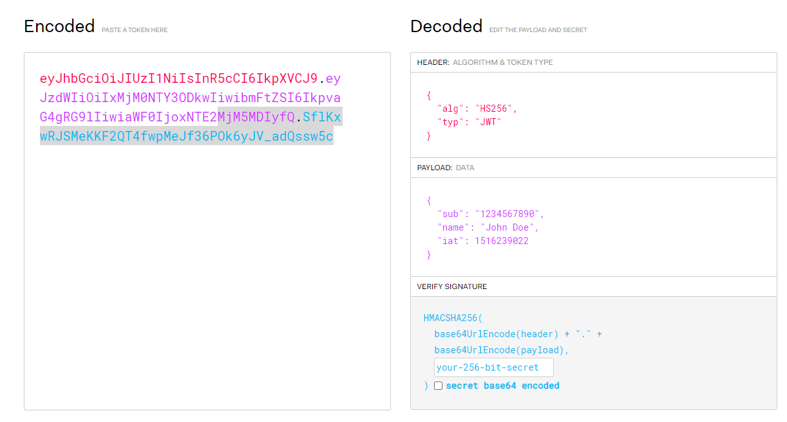
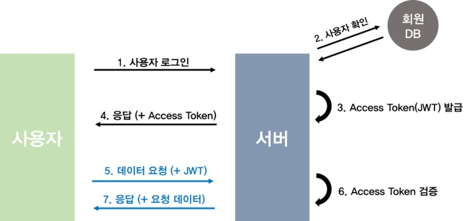

# JWT(Json Web Toekn)란?

## 등장 배경

> 기존의 시스템에서는 `서버(세션) 기반의 인증방식`을 사용하였다.  하지만 시스템의 규모가 커지면서 `서버 기반의 인증방식`은 한계점을 보이기 시작하였고, 이 문제점들을 보완하는 `토큰 기반의 인증 방식`이 등장하게 되었다.  그리고 최근에는 Json 포맷을 이용하는 JWT를 주로 사용한다.

### **서버(세션) 기반 인증 시스템**

- **서버 측**에서 사용자들의 **정보를 기억**
- 사용자들의 정보를 기억하기 위해서 **세션을 유지**하는데, **메모리 or 디스크 or DB** 등을 통해 관리 (**Sateful 서버**)
- 소규모 시스템에서는 아직도 많이 사용되고 있지만, 웹/앱 어플리케이션이 발달하면서 **몇 가지 문제점**이 보이기 시작
  1. 사용자가 많은 사이트의 경우 세션 저장 시 **메모리 or DB를 많이 차지**
  2. 서버를 확장하기 위해 세션을 분산시키는 시스템 설계해야 함. but 이 과정은 매우 **어렵고 복잡**하다.
  3. 여러 도메인에서 **관리하기 번거로운 쿠키** (**CORS**)

### **토큰 기반의 인증 시스템**

- 인증받은 사용자들에게 **토큰을 발급**하고, 서버에 요청을 할 때 헤더에 토큰을 함께 보내도록 하여 **유효성 검사 실시**
- 사용자의 인증 정보를 서버나 세션에 유지하지 않고 클라이언트 측에 저장 => 서버는 완전히 **Stateless**
  - 더이상 사용자가 로그인 되어있는지 안되어있는지 신경쓰지 않고 시스템 확장이 가능해진다.
- 클라이언트와 서버의 연결고리가 없어 **시스템 확장에 매우 적합(Scalability)**
  - 세션의 경우 해당 사용자는 처음 로그인 했었던 서버에만 요청을 받아야 하지만, 토큰의 경우 어떠한 서버로 요청이 와도 상관이 없다.
- 쿠키를 사용하지 않으므로 쿠키 사용에 의한 취약점이 사라짐
- 토큰에 선택적인 권한만 부여하여 발급이 가능 (**Extensibility**)
  - OAuth의 경우 Facebook, Google 등과 같은 소셜 계정을 이용하여 다른 웹서비스에서도 로그인을 할 수 있다. 
- 다양한 디바이스, 도메인에서도 토큰의 유효성 검사 진행 후 요청 처리 가능 (**CORS 문제 해결**)
  - 이런 구조를 통해 assests 파일(Image, html, css, js 등)은 모두 CDN에서 제공하고, 서버 측에서는 API만 다루도록 설게할 수 있다.

## JWT란?

- JWT는 `Json Web Token`의 약자로 **인증에 필요한 정보들을 암호화시킨 토큰**이다. 
- 세션/쿠키와 함께 모바일과 웹의 인증을 책임진다.
- 세션/쿠키 방식과 유사하게 사용자는 Access Tocken(JWT Token)을 HTTP 헤더에 실어 서버로 보내게 된다.
- Json 포맷을 이용하여 사용자에 대한 속성을 저장하는 **Claim 기반 Web Token**
  - **Claim(클레임)** 이란 사용자 정보나 데이터 속성 등을 의미
- JWT는 토큰 자체를 정보로 사용하는 **Self-Contained 방식**으로 정보를 안전하게 전달한다

## JWT 구조

JWT는 **Header, Payload, signature** 세 가지로 나눠져 있으며, Json 형태인 각 부분은 `Base64`로 **인코딩** 되어 포함된다.  또한 각각의 부분을 이어주기 위해 `.`구분자를 사용하여 구분한다. 

### Header

- `alg`
  - 해싱 알고리즘 방식 지정
  - 주로 HS256(SHA256) 또는 RSA를 사용하며, Signature 및 토큰 검증에 사용한다.
- `type`
  - 토큰의 타입을 지정 ex) JWT

### Payload

토큰에서 **사용할 정보**의 조각들인 **Claim(클레임)** 이 담겨 있다.

**Key/Value 방식**으로 이뤄져있으며 (JSON과 유사) 다수의 정보를 넣을 수 있다.

- Register Claim(등록된 클레임)

  - **토큰 정보를 표현하기 위해 이미 정해진 종류의 데이터**
  - 모두 **선택적으로 작성**이 가능하며 사용할 것을 권장

  | 키워드 | 의미                                                         |
  | :----: | ------------------------------------------------------------ |
  |  iss   | 토큰 발급자(issuer)                                          |
  |  sub   | 토큰 제목(subject)                                           |
  |  aud   | 토큰 대상자(audience)                                        |
  |  exp   | 토큰 만료 시간(expiration) NumericDate 형식으로 되어 있어야 함 ex) 1480849147370 |
  |  nbf   | 토큰 활성 날짜(not before) 이 날이 지나기 전의 토큰은 활성화되지 않음 |
  |  iat   | 토큰 발급 시간(issued at) 토큰 발급 이후의 경과 시간을 알 수 있음 |
  |  jti   | JWT 토큰 식별자(JWT ID) 중복 방지를 위해 사용하며, 일회용 토큰(Access Token) 등에 사용 |

- Public Claim(공개 클레임)

  - **사용자 정의 클레임**으로 **공개용 정보**를 위해 사용
  - 충돌 방지를 위해 **URI 포맷**을 이용

  `{ "https://naver.com": true }`

- Private Claim(비공개 클레임)

  - **사용자 정의 클레임**으로 **서버와 클라이언트 사이에 임의로 지정한 정보**를 저장

  `{ "token_type": access }`

### Signature

- 서명(Signature)은 토큰을 인코딩하거나 유효성 검증을 할 때 사용하는 **고유한 암호화 코드**

- 위에서 만든 **Header**와 **Payload**의 각 값을 **BASE64**로 인코딩 하고, 그 값을 비밀키를 이용해 헤더에서 **정의한 알고리즘**으로 해싱한다. 그리고 이 값을 다시 **BASE64**로 인코딩하여 생성

## JWT 동작 방식

1. 사용자가 ID와 PW를 입력하여 로그인 시도
2. 서버는 사용자가 맞는지 요청을 확인 
3. secret key를 통해 **Access Token(JWT)** 을 발급
4. JWT 토큰을 클라이언트에 전달
5. 클라이언트에서 API를 요청할 때, 클라이언트가 `Authorization header`에 **Access token(JWT)** 을 담아서 전달
6. 서버는 JWT Signature를 체크하고 Payload로부터 사용자 정보를 확인한 뒤 데이터를 반환

> [참고] 처음 사용자를 등록할 때 **Access token**과 **Refresh token**이 **모두 발급**되어야 함

## JWT 장단점

### 장점

사용자 인증에 필요한 모든 정보는 토큰 자체에 포함하기 때문에 **별도의 인증 저장소가 필요없다**

- URL 파라미터와 헤더로 사용
- 수평 스케일이 용이
- 디버깅 및 관리가 용이
- 트래픽 대한 부담이 낮음
- REST 서비스로 제공 가능
- 내장된 만료
- 독립적인 JWT

### 단점

- 토큰은 클라이언트에 저장되어 데이터베이스에서 사용자 정보를 조작하더라도 토큰에 직접 적용할 수 없다.
- 더 많은 필드가 추가되면 토큰이 커진다.
- 비상태 애플리케이션에서 토큰은 거의 모든 요청에 대해 전송되므로 데이터 트래픽 크기에 영향을 미칠 수가 있다.

## 유용한 상황

- 회원 인증 (JWT를 사용하는 가장 흔한 시나리오)
- 정보 교류
  - JWT는 정보가 `Signature`  되어있기 때문에 두 개체 사이에서 안정성있게 정보 교환하기 좋은 방법이다.

## 참고

- https://mangkyu.tistory.com/55

- https://elfinlas.github.io/2018/08/12/whatisjwt-01/
- http://www.opennaru.com/opennaru-blog/jwt-json-web-token/
- [JWT 구조 출처](https://jwt.io/)