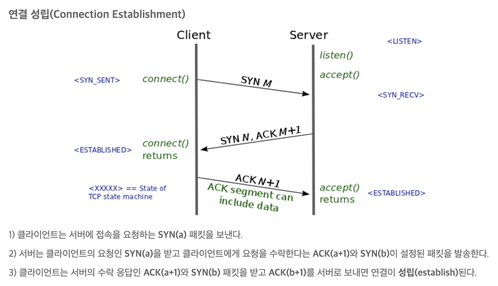
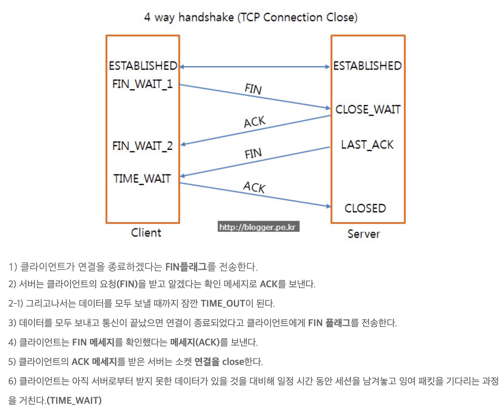
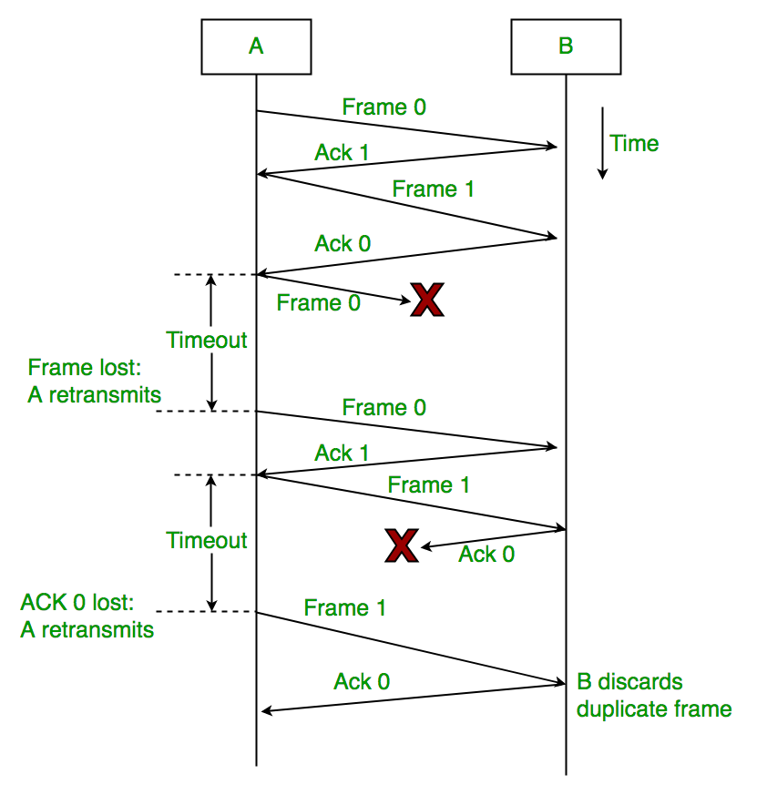
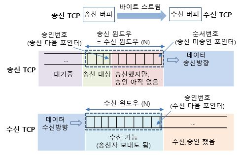

# TCP (Transmission Control Protocol)
> * 프로세스 대 프로세스 데이터 전달, 오류 검출, 재전송, 누적 확인응답, 순서번호, 확인응답 서비스를 제공해 신뢰성을 보장한다.   
>* TCP 프로토콜은 종단 시스템에서만 동작하고 중간의 네트워크 요소에서는 동작하지 않으므로 중간의 네트워크 요소들은 TCP연결을 유지하지 않는다.
>* 전이중(Full-duplex) 서비스를 제공한다.
>* 단일 송신자와 단일 수신자 사이의 점대점(point to point) 연결 이다.

# TCP Header   
                0                   1                   2                   3
                0 1 2 3 4 5 6 7 8 9 0 1 2 3 4 5 6 7 8 9 0 1 2 3 4 5 6 7 8 9 0 1   
                +-+-+-+-+-+-+-+-+-+-+-+-+-+-+-+-+-+-+-+-+-+-+-+-+-+-+-+-+-+-+-+-+
                |          Source Port          |       Destination Port        |
                +-+-+-+-+-+-+-+-+-+-+-+-+-+-+-+-+-+-+-+-+-+-+-+-+-+-+-+-+-+-+-+-+
                |                        Sequence Number                        |
                +-+-+-+-+-+-+-+-+-+-+-+-+-+-+-+-+-+-+-+-+-+-+-+-+-+-+-+-+-+-+-+-+
                |                    Acknowledgment Number                      |
                +-+-+-+-+-+-+-+-+-+-+-+-+-+-+-+-+-+-+-+-+-+-+-+-+-+-+-+-+-+-+-+-+
                |  Data |           |U|A|P|R|S|F|                               |
                | Offset| Reserved  |R|C|S|S|Y|I|            Window             |
                |       |           |G|K|H|T|N|N|                               |
                +-+-+-+-+-+-+-+-+-+-+-+-+-+-+-+-+-+-+-+-+-+-+-+-+-+-+-+-+-+-+-+-+
                |           Checksum            |         Urgent Pointer        |
                +-+-+-+-+-+-+-+-+-+-+-+-+-+-+-+-+-+-+-+-+-+-+-+-+-+-+-+-+-+-+-+-+
                |                    Options                    |    Padding    |
                +-+-+-+-+-+-+-+-+-+-+-+-+-+-+-+-+-+-+-+-+-+-+-+-+-+-+-+-+-+-+-+-+
                |                             data                              |
                +-+-+-+-+-+-+-+-+-+-+-+-+-+-+-+-+-+-+-+-+-+-+-+-+-+-+-+-+-+-+-+-+

 [출처] RFC793 : https://tools.ietf.org/html/rfc793#section-3.1

**Sequence Number** : 수신된 데이터의 순서를 알려준다. 순서 번호는 일련의 전송된 세그먼트에 대해서가 아니라 전송된 바이트의 스트림에 대한 것이다. 세그먼트에 대한 순서 번호는 세그먼트 데이터 부분의 첫 번째 바이트 영역이다.
> 50,000바이트로 구성된 데이터를 전송할 때 MMS는 1000이다. TCP는 데이터 스트림으로부터 500개의 세그먼트들을 구성한다. 각 세그먼트의 시작 부분은 0, 1000, 2000, 3000이 될 것이다. 이 부분을  Sequence Number 필드에 할당해준다.

**Acknowledgment Number** : 수신자가 송신자로부터 기대하는 다음 '바이트'의 순서번호이다. 이 필드를 이용해 누적 확인응답을 제공한다.
> 수신자가 0 ~ 535의 바이트를 포함하는 세그먼트와 900 ~ 1000의 바이트를 포함하는 또 다른 세그먼트를 수신했다고 가정하자. 수신자는 536~899의 세그먼트를 아직 수신하지 않았다. 그러므로 수신자는 송신자에게 Acknowledgment Number를 536으로 할당해주고 송신한다.    TCP는 첫 번째 잃어버린 바이트 까지의 바이트들까지만 확인응답한다.    
수신자는 3번째 세그먼트를 2번째보다 먼저 수신하였다. 2번째 세그먼트를 재전송을 요청했을 때 이미 수신한 3번째 세그먼트의 처리방법에 대해서 RFC는 규칙을 부여하지 않아 TCP 구현 개발자가 선택권을 갖는다. 1. 순서가 틀린 데이터를 즉시 버린다.   
2.순서가 틀린 데이터를 보유하고 빈 공간에 잃어버린 데이터를 채우기 위해서 기다린다. 

**Window** : 흐름제어에 사용된다. 이는 수신자가 받아들이려는 바이트의 크기를 나타내는데 사용된다.

**Data offset**  : TCP 헤더의 길이를 나타낸다. TCP헤더는 option field 때문에 가변적인 길이가 될 수 있다. (일반적으로는 옵션필드는 비어있다.)

**Padding** : TCP 헤더가 32비트의 배수가 되도록 필요한 부분에 0을 넣음.

**Control bits** : **URG**, **ACK**, **PSH**, **SYN**, **FIN**, **RST** 6가지로 구성되어있다.   
- URG : 이 세그먼트에서 송신측 응용계층이 "긴급"으로 표시하는 데이터임을 가르킨다. 이 데이터의 마지막 바이트 위치는 **Urgent Pointer**에 의해서 가리켜진다. (실제 사용되지는 않는다.)
- PSH : 수신자가 데이터를 상위 계층에 즉시 전달해야 함을 가리킨다. (텔넷에서 사용된다.)
- RST : TCP연결을 강제 중단할 때 사용한다.
- SYN : TCP 3-Way handsahke 시 오픈처리를 시작하는 쌍방의 각 SYN 플래그를 이용해 ACK 번호를 동기화한다.
- ACK : 유효한 ACK번호가 TCP헤더에 있는 것을 나타낸다.
- FIN : TCP연결을 종료하기 위한 플래그이다. 4-Way handshake에서 사용한다.

**Option** : 송,수신자가 최대 세그먼트 크기(MMS)를 협상하거나 고속 네트워크에서 사용하기 위한 윈도우 확장 요소로 이용된다. TCP 헤더는 기본 20바이트지만 옵션 필드를 사용한다면 최대 60바이트까지 사용 가능하다.

# MSS와 MTU
## MSS (Maximum segment size)
> TCP 상에서 전송할 수 있는 사용자 데이터의 최대 크기이다. MSS의 크기는 MTU에 의존한다.   
   송신 버퍼에 채워진 데이터가 MSS를 초과하거나 가까운 길이에 이를때 까지 데이터를 저장했다가 한번에 전송하면 데이터가 잘게 쪼개질 우려가 줄어든다. 하지만 데이터를 모아서 전송하기에 송신 시간이 오래걸린다.   
    그래서 프로토콜 스택의 내부 타이머를 이용해 일정 시간이 지나면 패킷을 송신합니다.
## MTU (Maximum transmission unit)
> IP Datagram의 최대 크기를 의미한다. MTU가 1500일때 IP, TCP 헤더를 제외한 크기가 MSS가 된다.   
OS의 종류와 버전에 따라 다 다르지만 Windows 계열에서는 기본 크기가 1500으로 설정되어있다. 

#### 2week
# 3-way/4-way handshake
> 3-way handshake : TCP 연결 설정 절차를 의미한다.   
4-way handshake : TCP 연결 해제 절차를 의미한다.

## 3-way handshake

1. SYN M 에서 추가로 클라이언트는 최초의 순서번호를 선택한다. 그리고 sequence Number 필드에 이 번호를 넣는다.
2. 서버는 TCP SYN 세그먼트를 추출해 연결에 버퍼와 변수들을 할당한다. 그리고 클라이언트에게 연결 승인 세그먼트를 송신한다. 이때 클라이언트가 보낸 최초의 순서번호 + 1을 한 값이 확인 응답 필드에 입력되며 sequence Number 필드에 자신의 최초이 순서 번호를 선택한다. : "당신의 최초 승인번호를 가지고 연결을 시작하기 위해서 당신의 SYN 패킷을 수신했고 나는 이 연결 설정에 동의한다. 나의 최초 순서번호는 ~ 이다."   
    - 이 세그먼트는 때때로 SYNACK 세그먼트라고 불린다.
3. 클라이언트는 연결에 버퍼와 변수들을 할당한다. 서버가 보낸 SYNACK 세그먼트에 응답을 전송한다.

## 4-way handshake

> Timewait는 2MSL(Maximum Segment Lifttime)동안 유지된다. [RFC0793] 2MSL은 120초이다.    
개발자 필요에 맞게 MSL을 30~300초 범위 내에서 수정 가능하다. 
# 흐름제어 (Flow control)
> 송신측이 수신측의 처리속도 보다 더 빨리 데이터를 보내지 못하도록 제어해 주는 것   
-> 수신자가 자신의 상태를 송신자에게 알린다. (수신자 버퍼의 오버플로우 방지 목적)

> 송신자가 수신 윈도우 라는 변수를 유지하여 흐름제어를 제공한다. 수신 윈도우는 수신 측에서 가용한 버퍼 공간이 얼마나 되는지를 송신자에게 알려주는데 사용된다.

## Stop and Wait
> 한번에 1개의 패킷만 전송하며 수신자가 프레임을 받음을 알리면 다음 프레임을 전송함.  
프레임을 전송하고 정해진 Timeout 값이 지나면 프레임을 재전송한다.    
패킷, ACK가 손실되는 경우와 Timeout 값이 너무 짧은경우 패킷을 재전송하기에 비효율적이다.

## Sliding-Window
> 두 개의 네트워크 호스트 간의 패킷 흐름을 제어하기 위한 방법이다. window structure를 사용한다.   
메모리 버퍼의 일정 영역을 window영역으로 설정하고 그 영역에 포함되는 패킷들을 모두 전송한다. 패킷들의 전달이 확인되는 대로 윈도우를 옆으로 옮김(slide)으로써 그 다음 패킷들을 전송하는 방식이다.

**윈도우 크기** : min(cwnd, rwnd)
**cwnd (Congestion window)**  : 송신자가 보낼 수 있는 세그먼트 크기
**rwnd (Received window)** : 수신자가 받을 수 있는 세그먼트 크기.
