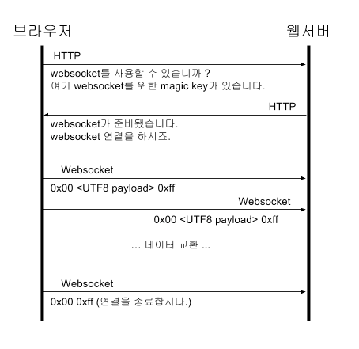

# WebSocket

## 요약

> 웹소켓이란 서버와 클라이언트 간의 효율적인 양방향 통신이 가능한 방법으로, 기본적으로 stateful protocol 방식이다. 
>
> 정보를 실시간 교류할 수 있디 때문에 채팅, 주식과 같은 즉각적인 변화를 감지해야 하는 서비스에 좋다. 
>
> 그러나 개발이 복잡하고 서버와 클라이언트 간의 소켓 연결을 유지하는 것 자체가 비용이 크기 때문에 트래픽 양이 많은 서버의 경우 CPU에 부담을 줄 수 있다. 또한 HTML5 이전 브라우저에서는 지원되지 않아 작동하지 않는다. 마지막 문제를 해결하기 위해 나온 기술 중 하나가 node.js 기반으로 만들어진 socket.io라는 프레임워크이다.

## Socket이란?

- 프로그램이 네트워크 상에서 데이터를 송신과 수신을 하기 위한 연결부 (통신을 위한 일종의 통로)
- 일반적으로 TCP/IP (또는 UDP) 프로토콜을 이용하거나, WebSocket을 이용한다.
  - TCP/IP: **연결형 소켓**. 신뢰할 수 있는 통신
  - UDP: **비연결형 소켓**. 몇가지 신뢰도는 포기하되 좀더 직접적인 통신을 한다

## WebSocket이란?

- HTML5의 표준 기술
- Transport protocol의 일종으로 서버와 클라이언트 간의 효율적인 **양방향 통신**을 실현하기 위한 구조

- 단순한 API로 구성
- 웹소켓을 이용하면 **하나의 HTTP 접속**으로 **양방향 메시지**를 자유롭게 주고받을 수 있다.

> 웹소켓 이전의 기존 HTTP 통신은 단방향 통신으로, 클라이언트의 요청이 없다면 서버로부터 응답을 받을 수 없는 구조였다.  이 문제를 극복하기 위해 등장한 것이 WebSocket!!

## 특징

- **양방향 통신(Full-Duplex)**
  - 데이터 송수신을 동시에 처리할 수 있는 통신 방법
  - 클라이언트와 서버가 서로에게 원할 때 데이터를 주고 받는다
- **실시간 통신/성능(Real Time-Networking)**
  - 웹 환경에서 연속된 데이터를 빠르게 노출한다.
  - 여러 단말기에 데이터를 빠르게 교환한다.
  - ex) 채팅, 주식, 비디오 데이터

## 작동 원리

- 웹소켓 연결은 HTTP 프로토콜을 통해 이루어짐
- handshake 과정이 성공적으로 끝나면 HTTP를 웹소켓 프로토콜로 바꾸는 protocol switching 과정이 진행됨
- 이후 웹소켓을 위한 새로운 소켓이 만들어지고 이 소켓을 이요해 통신한다.

> 웹소켓 주소는 ws나 wss로 시작하는데 ws는 일반 웹소켓, wss는 SSL이 적용된 웹소켓

## 문제점

- 프로그램 구현에 보다 많은 복잡성 초래
- Stateful Protocol 특성
  - 웹소켓은 HTTP와 다르게 **항상 클라이언트와 서버 간의 연결을 유지**해야 함
  - 비정상적으로 연결이 끊어졌을 경우에 대한 대응 필요
- 서버와 클라이언트 간의 Socket 연결을 유지하는 것 자체가 자원 소모 (특히 트래픽 양이 많은 서버의 경우)
- HTML5의 기술이기 때문에 이전 버전의 웹 브라우저에서 지원이 되지 않는다.
  - 이 문제를 해결하기 위해 나온 기술 중 하나가 바로 `Socket.io` 라는 웹소켓 프레임워크
  - 웹페이지가 열리는 브라우저가 웹 소켓을 지원하면 웹 소켓 방식으로 동작하고, 지원하지 않는다면 일반 HTTP를 이용하여 실시간 통신을 흉내 내는 것

## 대표적인 사용 예

- 페이스북, 인스타와 같은 SNS APP
- 위치 기반 APP
- 화상 채팅 APP
- 증권 거래 정보 사이트 및 APP
- 구글 Doc 같이 여러 명이 동시 접속해서 수정할 수 있는 Tool
- LOL 같은 멀티플레이어 Game

## 참고

- https://choseongho93.tistory.com/266
- https://kyleyj.tistory.com/59
- https://d2.naver.com/helloworld/1336
- https://dailyscat.gitbook.io/twis/network/undefined