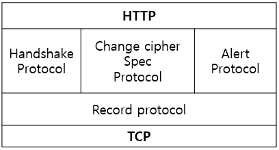
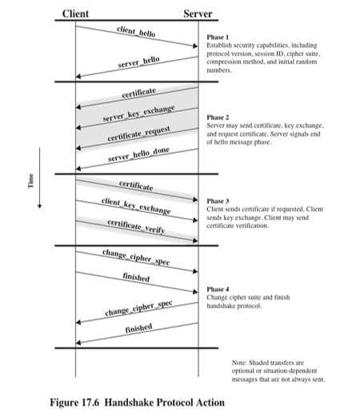
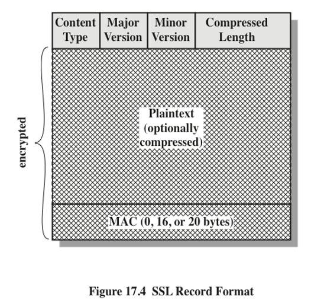
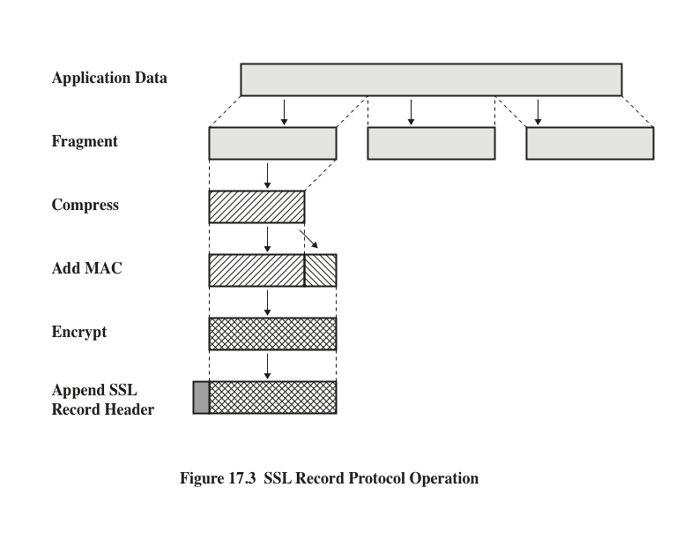

# SSL과 TLS 

## SSL (Secure Sockets Layer - 보안 소켓 레이어)
    컴퓨터 네트워크에서 통신 보안을 제공하기 위해 설계된 암호화 규약이다. 
    SSL은 TCP 통신에 의존한다. (메세지를 교환할 때 신뢰성이 보장이 되어야 함)
    주로 웹 서비스 보안에 많이 사용된다. -> HTTPS

## TLS (Transport Layer Security - 전송 계층 보안)
    SSL이 최신으로 표준화 되면서 바뀐 이름이다.
    PCT1.0, SSL 1.0 그리고 SSL 2.0이 통합된 버전으로 TLS 1.0이 되었다.
    TLS는 OSI 7계층 중에 어느 곳에 속하지 않고, Application계층과 Transport계층 사이에 독립적인 프로토콜 계층을 만들어서 동작한다.
    
 

## TLS 기본 절차
1. 지원 가능한 알고리즘 서로 교환
2. 키 교환, 인증 : (교환 : RSA, Diffie-Hellman, ECDH, SRP, PSK / 인증 : RSA, DSA, ECDSA)   -> 여기까지 Handshake  
3. 대칭키 암호로 암호화, 메세지 인증
    - (암호화 : RC4, 3DES, AES, DES, IDEA, ARIA ~ / 인증 : HMAC-MD5 or HMAC-SHA)
    -  SSL에서는 인증에 MD5와 SHA, 구버전 SSL에서는 MD2와 MD4가 사용되었다.

 

## TLS 중요 개념
1. Session 
    * Handshake protocol에 의해서 생성되는 Client와 Server의 협약이다.   
      세션은 결정된 암호화 기법들에 대한 정보를 갖고있으며, 여러개의 Connection을 가질 수 있다.    
      그 이유는 웹 환경에서 Connection은 빈번하게 일어나는데 이때 암호화 기법을 협의하는 비용을 줄이기 위해서다.
2. Connecion   
    * Transport layer에서 제공하는 서비스이다. peer to peer 관계이며 일시적인 성질을 가지고 있다.   
    1개의 Session에 여러개의 Connection이 존재할 수 있으며 각 Connection마다 다른 Key를 사용한다.
    
 

## TLS Protocol Stack
* 프로토콜 스택이란 : 다양한 계층의 프로토콜을 모두 합한 것을 통칭하는 말.

</img>
* **Handshake protocol** : Client와 Server의 암호화 알고리즘 및 키 크기를 합의.
    * [Handshake]   
            </img>   
            - Phase 1 : 알고리즘 키 사이즈 결정 단계
            - Phase 2,3 : 인증서와 키 교환 절차 진행
            - Phase 4 : 적절한 암호화 기법 교환 (Handshake 종료)

* **Change cipher spec protocol** : 이 프로토콜은 1바이트 짜리 프로토콜이다. 값은 1을 가지며 암호화 알고리즘 교환을 시작하겠다고 알리는 역할을 한다.
* **Alert protocol** : 통신을 하는 양측에 에러나 오류같은 사항을 알리기 위해서 사용한다.
2개의 바이트로 구성되어있다. Level은 warning, fatal을 가르키며, Alert는 각종 메세지를 가르킨다.
* **Record protocol** : TLS의 Connection의 메세지 무결성과 기밀성을 제공해준다. 
    *   Confidentiality : Handshake protocol을 통해 정한 암호화 기법과 공유한 키를 이용해 paylode데이터를 암호화한다.
    *   Msg integrity : HMAC을 Data 끝부분에 추가해준다.
    * [Record format]   
        </img>
    * [Record operation] - compressed는 선택
        </img>

## MAC (Message Authentication Code)
> * 메세지 인증에 쓰이는 작은 크기의 정보이다. MAC 알고리즘은 비밀 키를 입력받고, 임의 길이의 메시지를 인증한다. 

## HMAC (Hash based MAC)
> * 일방향성 hash 함수를 이용해서 메세지 인증 코드를 구성하는 방법이다.
> * DES 암호화 기법보다 속도가 빠르며, IP 보안에서 사용이 강제된다.