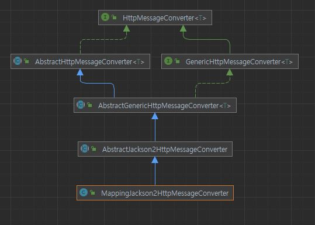
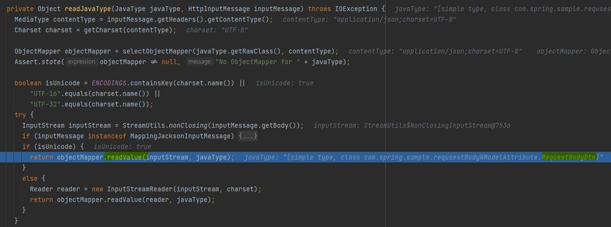

# RequestBody & ModelAttribute
|작성자|작성일|
|:--:|:--:|  
|KODO|2022.04.10.|

Spring에서 Http 프로토콜의 body를 가져오는 두가지 방법에 대해서 이해하고 차이를 알아보자.   

---
## @RequestBody
`Annotation indicating a method parameter should be bound to the body of the web request. The body of the request is passed through an HttpMessageConverter to resolve the method argument depending on the content type of the request. Optionally, automatic validation can be applied by annotating the argument with @Valid.` [출처](https://docs.spring.io/spring-framework/docs/current/javadoc-api/org/springframework/web/bind/annotation/RequestBody.html)

위 문장에 따르면 **`@RequestBody`** 은 Http request의 json타입 body를 **`HttpMessageConverter`** 를 이용해 DTO로 변환해준다(HTTP 요청의 바디 영역을 전부 DTO로 변환한다.).

   
이때 `MappingJackson2HttpMessageConverter.readJavaType()`에서 ObjectMapper를 사용해 Body를 DTO 타입으로 변환하는 것을 볼 수 있다. OpjectMapper는 reflection을 사용하기 때문에 `default constructor`가 **강제**된다.
   

**정리**   
ObjectMapper는 리플렉션을 사용해 객체를 구성하는 특징이 있다. 하지만 Json데이터를 Java 객체로 바인딩 할 때 getter나 setter를 사용해 맵핑할 필드명을 사용한다고 한다.
실제로 getter, setter를 모두 사용하지 않는 경우 필드의 값이 모두 `null`인 객체가 반환된다.
- JSON, XML, TEXT등의 HTTP Body를 HttpMessageConverte이용해 Java 객체로 바인딩
- Refelection을 사용하기 때문에 기본 생성자 필수
- Getter, Setter 중 1개는 필수

## @ModelAttribute
`Annotation that binds a method parameter or method return value to a named model attribute, exposed to a web view. Supported for controller classes with @RequestMapping methods.`
`Can be used to expose command objects to a web view, using specific attribute names, through annotating corresponding parameters of an @RequestMapping method.`
`Can also be used to expose reference data to a web view through annotating accessor methods in a controller class with @RequestMapping methods. Such accessor methods are allowed to have any arguments that @RequestMapping methods support, returning the model attribute value to expose.`
`Note however that reference data and all other model content is not available to web views when request processing results in an Exception since the exception could be raised at any time making the content of the model unreliable. For this reason @ExceptionHandler methods do not provide access to a Model argument.` [출처](https://docs.spring.io/spring-framework/docs/current/javadoc-api/org/springframework/web/bind/annotation/ModelAttribute.html)

위 문장에 따르면 `@ModelAttribute`는 클라이언트로부터 전송 받은 HTTP 파라미터나 웹 뷰 반환값을 Java 객체로 바인딩합니다.

GET, POST 메소드 타입 모두 바인딩이 가능합니다. 
필수 조건으로는 요청으로 보낸 GET 파라미터, FORM 데이터가 모두 존재해야합니다. 하나라도 누락될 경우 400 오류가 뜹니다.

**정리**   
- HTTP 파라미터 데이터를 Java 객체에 매핑한다.
- 생성자 혹은 Setter가 필요하다. (기본 생성자 제외)
- Query string, form 데이터 외에는 바인딩이 불가능하다.

