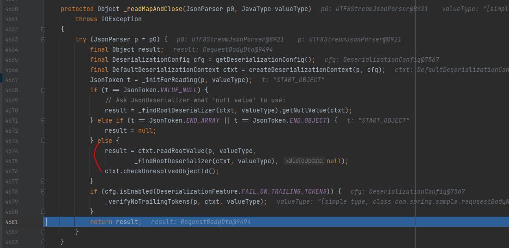
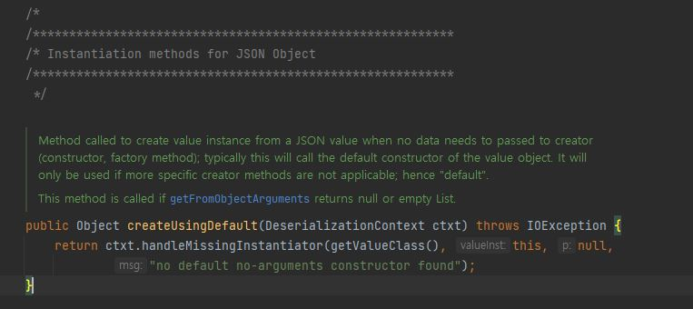
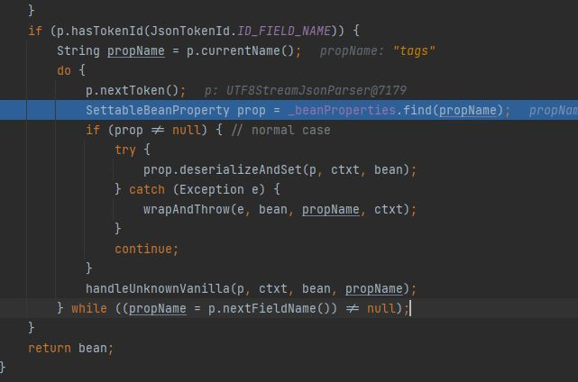

# RequestBody & ModelAttribute
|작성자|작성일|
|:--:|:--:|  
|KODO|2022.04.10.|

Spring에서 Http 프로토콜의 body를 가져오는 두가지 방법에 대해서 이해하고 차이를 알아보자.   

---
### @RequestBody
`Annotation indicating a method parameter should be bound to the body of the web request. The body of the request is passed through an HttpMessageConverter to resolve the method argument depending on the content type of the request. Optionally, automatic validation can be applied by annotating the argument with @Valid.` [출처](https://docs.spring.io/spring-framework/docs/current/javadoc-api/org/springframework/web/bind/annotation/RequestBody.html)

위 문장에 따르면 **`@RequestBody`** 은 Http request의 json타입 body를 **`HttpMessageConverter`** 를 이용해 DTO로 변환해준다(HTTP 요청의 바디 영역을 전부 DTO로 변환한다.).

이때 `MappingJackson2HttpMessageConverter.readJavaType()`에서 ObjectMapper를 사용해 Body를 DTO 타입으로 변환하는 것을 볼 수 있다.

이때 `ObjectMapper._readMapAndClose()`를 살펴보면 Deserialization을 하는 것을 확인할 수 있다.

이미지에서 4674 ~ 4676 부분이 실제 Java object로 변환하는 부분이다.

Deserialize에 대해서는 따로 다뤄야하지만 간단하게 말하면 `default constructor`를 사용하기 때문에 final이 불가능하다. 
  - BeanDeserializer.deserializeFromObject()에서 ValueInstantiator.createUsingDefault()를 호출한다.
    
    내용에서 확인할 수 있지만 이 함수를 호출할 경우 생성자나 factory 메서드를 건너뛰고 default constructor를 사용해 객체를 생성한다. 이때 생성된 객체의 field는 모두 null이 들어가있다.
  - BeanDeserializer.deserializeFromObject()의 하단에서 HttpBody를 역직렬화하고 parser로 변환한 것에서 propertyName를 반복문을 통해서 뽑아낸다.
  

**결론**   
@RequestBody는 Http의 body가 json이어야 한다는 제약사항이 존재한다. http body 자체를 전부 dto로 치환하기 때문이다. 실제로 소스코드를 살펴보면 byte[] 형태로 입력받은 http body를 역직렬화를 통해 